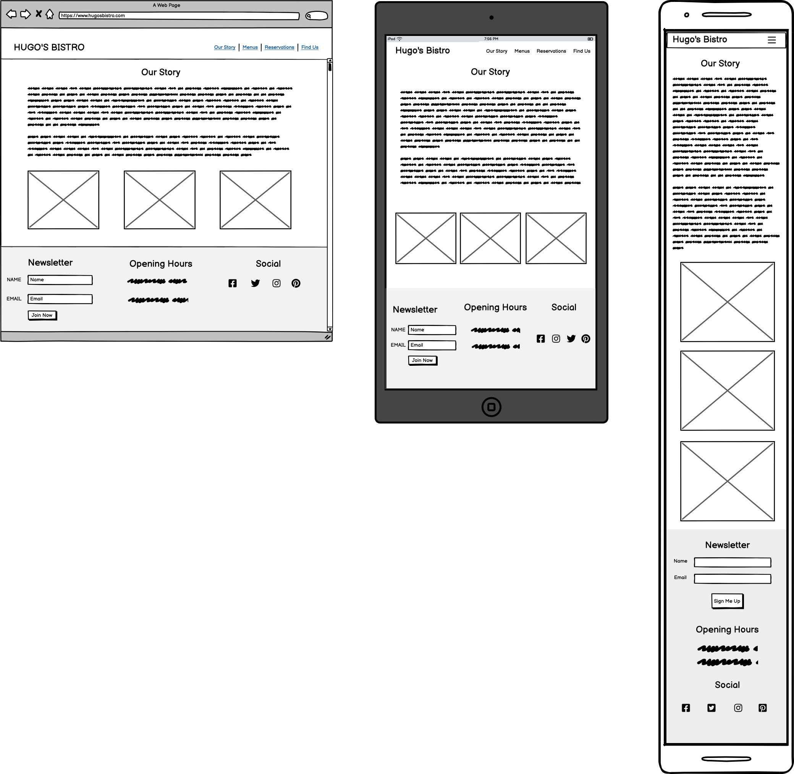

# First Milestone Project: Hugo's Bistro

## Introduction

This repository contains all the necessary information and code for the website of Hugo's Bistro, a fictional French restaurant located in Cardiff. The website aims to provide visitors with a positive online experience that encourages them to make a reservation and / or find information about the restaurant.

## Table of Contents

- [Business-Goals](#business-goals)
- [5-Planes-of-UX](#5-planes-of-ux)
- [User-Stories](#user-stories)
- [Wireframes](#wireframes)
- [Features](#features)
- [Technology](#technology)
- [Testing](#testing)
- [Deployment](#deployment)
- [Credits](#credits)
- [References](#references)

## Business Goals

### Hugo's Bistro website is designed to achieve the following business objectives:

- Promote Hugo's Bistro as a premier French restaurant in Cardiff.
- Provide an overview of the restaurant's menus, including its French culinary specialties.
- Encourage visitors to make reservations by showcasing the restaurant's incredible food.
- Establish an online presence to increase brand visibility and engage with the local community.
- To strengthen the brand identity. The restaurant has been running since 1985.
- To increase sales by more users booking through the website
- For the website to create an emotional trigger with users and to make a booking.
- A user friendly and aesthetically beautiful website to reflect the quality food and service that Hugo's Bistro offers.
- For new users to understand who we are and what we do.

### Hugo's Bistro website aims to fulfil the following user goals:

- Discover information about Hugo's Bistro, such as its location, opening hours, and contact details.
- Explore the menu and gain insights into the variety of French dishes available.
- Make reservations conveniently through an intuitive online booking system.
- Stay informed about upcoming events, special promotions, and seasonal menus by joining the newsletter.
- Experience the relaxed ambience of Hugo's Bistro through visually appealing imagery and engaging content.
- To navigate through the website with ease.
- To look at the food and drink menus on offer with easy accessibility.
- To find contact information about the website.

## 5 Planes of UX

To ensure a comprehensive and seamless user experience, Hugo's Bistro website focuses on the following five planes of UX:

**Strategy:** The website aligns with the business goals of promoting Hugo's Bistro and engaging users effectively. It encompasses a user-centered design approach to meet the needs of visitors and drive bookings. The aim is to create a website that is visually appealing, and users instinctively recognise what Hugo's Bistro represents - a relaxed and a good quality French establishment.

**Scope:** The website provides essential information about Hugo's Bistro, including its menus, our story page, reservation form and contact information. It emphasises simplicity and clarity to ensure visitors can easily find the desired information.

**Structure:** The website's navigation is intuitive and well-organised, enabling users to browse different sections effortlessly. It employs a clear hierarchy, logical grouping, and consistent labelling for easy exploration.

**Skeleton:** The website's layout, typography, and visual elements are designed to create an aesthetically pleasing and harmonious interface. It utilises a responsive design to ensure optimal viewing experiences across various devices and screen sizes.

**Surface:** The website utilises appealing visuals, captivating imagery, and high-quality content to evoke the relaxed ambiance and culinary excellence of Hugo's Bistro. The colour scheme, typography, and overall style align with the brand identity - traditional, high quality and in a relaxing setting.

## User Stories

### New Users

As a new user of the Hugo's Bistro website:

- I want to learn about the restaurant's concept, history, and values.
- I want to explore the menu to see the variety of French dishes offered.
- I want to find the restaurant's contact information, opening hours, and location.
- I want to make a reservation.

### Returning Users

As a returning user of the Hugo's Bistro website:

- I want to check if there are any new additions or changes to the menu.
- I want to quickly access the online reservation system to book a table.
- I want to find the restaurant's phone number or email.

### Frequent Users

As a frequent user of the Hugo's Bistro website:

- I want to easily access the website on my mobile device or tablet.
- I want to sign up for a newsletter to receive updates on new menus and events.
- I want to check if there are any new additions or changes to the menu.

## Wireframes

#### Homepage

#### Our Story

#### Menus

#### Reservations

#### Find Us

## Features

Each page consists of the navigation bar fixed to the top of each page to help visitors click through the site with ease. You will also find the footer at the bottom of each page that includes form to sign up to the newsletter, opening hours and links to Hugo’s social media pages.

### Homepage

The homepage of the Hugo's Bistro website includes the following features to enhance user engagement and provide a captivating experience:
A visually appealing hero's image is featured on the homepage. This image captures the user’s attention and entices them to explore more. There’s also a prominent call-to-action button is strategically placed on the hero image, encouraging users to make reservations directly.
Below the hero image displays positive customer reviews to show the restaurant's excellent reputation and customer satisfaction. These reviews serve as social proof and encourage visitors to explore further.
Below the review section is a small snippet from the opening paragraph of the ‘Our Story’ page with a call-to-action button.

### Our Story Page

The Our Story page of Hugo's Bistro provides content about the heritage and culinary inspiration behind the restaurant.
You will also find three images below the content that highlight the quality and values of the restaurant.

### Menus Page

The Menus section of Hugo's Bistro website is designed to showcase our diverse range of culinary offerings. With enticing imagery and easy access to each menu, this section allows visitors to explore and discover food and drink options are available. Here are the key features of the Menus section:
The Menus section features four captivating images - lunch, dinner, specials, and drinks. Each image highlights a specific menu on offer with overlay text explaining what time the menu is available and a pdf link of the menu which opens in a separate tab.

### Reservation Page

Features a user-friendly booking form where visitors can fill in the required details to make a reservation. Each section is required to be filled out correctly to make a booking.
The form includes the following sections:
name, time, date, email, phone number, number of Guests and allergy / dietary requirement text area with a book now button below.

JavaScript Dependency for Time Input
Please note that the time input on the booking form currently requires JavaScript to function correctly which I have not covered in the course yet.

### Find Us Page

Features the email, contact number and address for Hugo's Bistro.

### Features to be included in the future:

- The location of the restaurant using Google maps on the find us page.
- Time input on the reservation form requires JavaScript to allow booking times between 12 and 22:00 every 15 minutes.
- Captcha to deter spam for both the newsletter and reservation form. JavaScript required.
- To include more images of the decor, service and drinks as a carousel on the homepage.

## Technology

- **Language:** HTML, CSS
- **Google Fonts:** Montserrat for headings and Playfair Display for content
- **Font Awesome:** for the social media icons in the footer
- **Bootstrap 5:** used for the grid system in aid of responsive design for the navigation bar, footer and sections in each page.
- **Code Anywhere:** used as a cloud code editor.
- **GitHub:** used as a cloud based code repository.

### Color used

- **Headings:** Dark olive green #455828
- **Nav bar and footer background:** Off white #fafafa
- **Content:** black

## Testing

Both CSS and HTML code was validated and showed no signs of errors with W3C Markup validator and W3C CSS Validator.

### Page Speed Insights

#### Mobile:

#### Desktop:

### Contrast Checker:

I had to change the contrast of the colour green used for the heading to become slightly darker from #556B2F to #455828 in order to pass.

### Manual Testing of User Actions

| **Feature**       | **Action**                                                       | **Behaviour**                                                           | **Result** |
| ----------------- | ---------------------------------------------------------------- | ----------------------------------------------------------------------- | ---------- |
| Navbar            | click logo                                                       | navigates to homepage                                                   | pass       |
| Navbar            | click Our Story                                                  | navigates to Our Story                                                  | pass       |
| Navbar            | click Menus                                                      | navigates to menus                                                      | pass       |
| Navbar            | click Reservations                                               | navigates to Reservations                                               | pass       |
| Navbar            | click Find Us                                                    | navigates to Find Us                                                    | pass       |
| Mobile Menu       | click hamburger icon                                             | displays menu items                                                     | pass       |
| Mobile Menu       | click hamburger icon                                             | collapses menu items                                                    | pass       |
| Homepage          | click call to action button: BOOK NOW                            | navigates to Reservations                                               | pass       |
| Homepage          | click call to action button: READ MORE                           | navigates to Our Story                                                  | pass       |
| Footer            | Clicked Newsletter: SIGN ME UP!                                  | pop-up: "please fill in this field"                                     | pass       |
| Footer            | entered details: clicked SIGN ME UP!                             | data post's to https://formdump.codeinstitute.net                       | pass       |
| Footer            | Hover cursor on each social icon                                 | colour trasition to green                                               | pass       |
| Footer            | click social Facebook icon                                       | navigates on separate tab to Facebook                                   | pass       |
| Footer            | click social Twitter icon                                        | navigates on separate tab to Twitter                                    | pass       |
| Footer            | click social Pinterest icon                                      | navigates on separate tab to Pinterest                                  | pass       |
| Footer            | click social Instagram icon                                      | navigates on separate tab to Instagram                                  | pass       |
| Menus page        | click Lunch menu                                                 | cursor pointer active and opens on separate tab                         | pass       |
| Menus page        | click Dinner menu                                                | cursor pointer active and opens on separate tab                         | pass       |
| Menus page        | click Specials menu                                              | cursor pointer active and opens on separate tab                         | pass       |
| Menus page        | click Drinks menu                                                | cursor pointer active and opens on separate tab                         | pass       |
| Reservations page | Date: clicked date icon                                          | displays calender                                                       | pass       |
| Reservations page | Date: entered date manually                                      | displays date entered                                                   | pass       |
| Reservations page | Time: clicked time icon                                          | displays time                                                           | pass       |
| Reservations page | Time: entered time manually                                      | displays time entered                                                   | pass       |
| Reservations page | Name: entered text                                               | input field displays text                                               | pass       |
| Reservations page | Email: entered email address                                     | input field displays email address (form works with email address only) | pass       |
| Reservations page | Phone: entered numbers                                           | input field displays numbers                                            | pass       |
| Reservations page | Clicked 'No. of Guests' drop down                                | displays drop down                                                      | pass       |
| Reservations page | Typed in Text area                                               | Displays text                                                           | pass       |
| Reservations page | Clicked BOOK NOW button without filling in 'date' field          | pop-up: "please fill in this field"                                     | pass       |
| Reservations page | Clicked BOOK NOW button without filling in 'time' field          | pop-up: "please fill in this field" excluding                           | pass       |
| Reservations page | Clicked BOOK NOW button without filling in 'name' field          | pop-up: "please fill in this field" excluding                           | pass       |
| Reservations page | Clicked BOOK NOW button without filling in 'email' field         | pop-up: "please fill in this field" excluding                           | pass       |
| Reservations page | Clicked BOOK NOW button without filling in 'phone' field         | pop-up: "please fill in this field" excluding                           | pass       |
| Reservations page | Clicked BOOK NOW button without filling in 'no. of guests' field | pop-up: "please fill in this field" excluding                           | pass       |
| Reservations page | Clicked BOOK NOW button without filling in text area field       | data post's to https://formdump.codeinstitute.net                       | pass       |

### Devices and Browsers Used for Testing

Mac Pro 2014

- Safari
- Firefox
- Chrome

Dell desktop

- Safari
- Firefox
- Chrome

Iphone 8

- Safari
- Firefox
- Chrome

### Known Bugs:

- Hamburger icon in the navbar will not align to the right of the page without nearly overlapping the menu list.
- Reservations: time input displays all times available. It would be more user friendly to offer booking slots available every 15 minutes between 12 and 22:00.
- Reservations: phone input field allows you to enter text and numbers. It would be better to allow number entry only.

## Deployment

### Setting up GitHub pages:

1. hello my name
1. My name is john
1. something random
1. Any changes made and pushed to the main branch will automatically show up on the site.

### Making changes to the website:

First you need to sign-up to GitHub and Code Anywhere. To do this please see below.

#### Create a Code Anywhere account:

1. If you don't already have one, go to the Code Anywhere website https://codeanywhere.com/signup and create a new account.
2. Enter first and last name.
3. Enter Email
4. Enter new password

#### Create a GitHub account:

1. If you don't already have one, go to the GitHub website https://github.com/ and create a new account.
2. Click sign up
3. Enter email address
4. Enter username
5. Create password
6. Verify your account by solving the puzzles
7. Click create account
8. Verify your account in using your sign-up email

To access the code to this project there are two options: **Cloning** and **Forking**.

Cloning: code will be linked to your repo and any pushes you make will go to the original developer for approval.

#### Here is how to clone code:

1. On GitHub.com, navigate to the main page of the repository. You can find that [here](https://github.com/DomGambarini/first-milestone-project)
2. Above the list of files, click <> **Code**.
3. Copy the URL for the repository.
4. In a separate tab, open Code Anywhere
5. Create a new workspace
6. Type ' git clone ', and then paste the URL you copied earlier.
7. Press Enter to create your local clone.

Forking: refers to creating a personal copy of someone else's repository under your own GitHub account. This copy is stored in your account and allows you to freely experiment with and make changes to the code without affecting the original repository. If I make changes to the original repo you will be informed and have the option to pull.

#### Here is how to fork code:

1. Log in to your GitHub account and navigate to the repository you want to fork. You can find that [here](https://github.com/DomGambarini/first-milestone-project)
2. On the repository's page, click on the "Fork" button located at the top right corner of the page. This action creates a copy of the repository under your GitHub account.
3. GitHub will redirect you to the forked repository, which is now hosted under your account. You can identify it by the "forked from" message displayed at the top of the repository name.
4. At this point, you have successfully forked the repository, and you can start working with the code.

## Credits

**Code:**

- Navigation Menu: Idea taken from [Adrian Twarog](https://www.youtube.com/watch?v=qNifU_aQRio&t=387s). Edited for my own requirements.
- Reservation form: Idea taken from [The Net Ninja](https://www.youtube.com/watch?v=dKVX22GR7zQ). Heavily edited for my own design.
- Social links in footer. Taken from Code Institute [Putting it all Together: Mini Project with Bootstrap 4](https://learn.codeinstitute.net/courses/course-v1:codeinstitute+FE+2017_T3/courseware/616289d66b5641a3808cc43e53842695/b51f7b8b815c4bcd9979d2281b6d97a9/). Adjusted for my own design.

## References

- All images taken from [unsplash.com](https://unsplash.com/)
- Hero Image, [Rick Barrett - Ambitious Studio](https://unsplash.com/photos/6pHiNI4qEnQ)
- Our Story Image on Homepage, [Tom Sekula](https://unsplash.com/photos/OiKfcBQoLO8)
- Our Story Page, Mussels in basket, [Matt Seymour](https://unsplash.com/photos/c8YyNoxiFLw)
- Our Story Page, Mussels cooking, [Margo Brodowicz](https://unsplash.com/photos/VHMeU2sUGAs)
- Our Story Page, Mussels dish, [Nikolay Smeh](https://unsplash.com/photos/godkmdG6M6o)
- Lunch Menu, [Liuda Brogiene](https://unsplash.com/photos/fTcJd8Nzao0)
- Dinner Menu, [Kyle Mackie](https://unsplash.com/photos/1IxhHrTxbwI)
- Specials Menu, [Marko Markovic](https://unsplash.com/photos/56kWr2jlorw)
- Drinks Menu, [Rick Barrett - Ambitious Studio](https://unsplash.com/photos/0DgZCy1hi5o)
